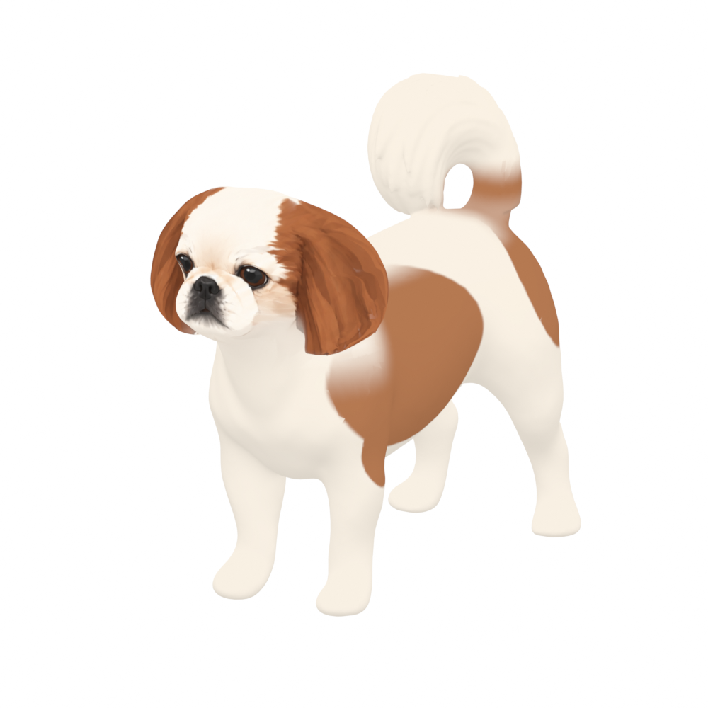

# 봉구 · Bonggu 3D

소중한 반려견 봉구를 닮은 그림 스타일의 3D 모델입니다. macOS·Windows 데스크톱 펫에 사용할
Blender 원본, GLB, 리그와 동작을 담고 있습니다. 데스크톱 앱 자체는 아직 포함하지 않습니다.



**[전체 행동 프리뷰 보기 · 1분 39초](previews/bonggu-actions-preview.mp4)**

최신 23개 동작과 이전 리그의 앞발 긁기·냄새 찾기·하울링까지 26개 샘플을 이어 붙였습니다.
영상에 동작 이름과 리그 구분을 표시하며, 걷기·달리기는 반복해서 보여줍니다. 소리는 없습니다.

## 사용할 파일

| 목적 | 파일 |
|---|---|
| 최신 동작 모델 · 앱 연결 | [bonggu-v2-everyday.glb](locomotion/bonggu-v2-everyday.glb) |
| 최신 동작 편집 | [bonggu-v2-everyday.blend](locomotion/bonggu-v2-everyday.blend) |
| 새 동작을 만들 중립 리그 | [bonggu-v2-tail-rig.blend](locomotion/bonggu-v2-tail-rig.blend) |
| 승인된 고화질 정적 원본 | [bonggu-v2-master.blend](release/bonggu-v2-master.blend) · [GLB](release/bonggu-v2-master.glb) |
| 정적 경량 모델 | [bonggu-v2-desktop.glb](release/bonggu-v2-desktop.glb) |
| 그림 설계도 | [references/](references/) |

최신 GLB는 약 6.7MiB, 36,201 삼각형, 78개 스킨 관절이며 `Smile`·`Yawn`·`EyesClosed` 표정과 23개 동작을 포함합니다.
Blender 편집 리그는 조작·보조 본을 포함해 112개 본입니다. 실행용 모델은 승인된 2K 텍스처를 내장합니다.
고화질 정적 원본은 505,204 삼각형과 4K 텍스처를 보존합니다.

동작의 타이밍과 순서는 시츄 영상과 개 보행·행동 연구를 근거로 정했습니다([references.json](locomotion/references.json)).
걷기는 한 주기 0.53초의 측대보, 달리기는 0.33초의 트롯이고, 앉기·엎드리기는 부위별로 순서를 두어 움직입니다.
귀와 꼬리는 머리·몸의 움직임을 늦게 따라가는 스프링으로 흔들리고, 쉬는 동작에는 호흡이 들어 있습니다.
걸을 때는 견갑골이 앞다리와 함께 앞뒤로 움직이고, 목이 몸통의 흔들림을 대부분 상쇄해 머리가 안정됩니다.
긴 귀는 머리를 숙이거나 들 때 아래로 처지고, 고개를 돌릴 때는 같은 쪽으로 살짝 갸웃합니다.
공개 사족보행 리그(Rigify 늑대·고양이 메타리그, Khronos Fox, Quaternius Shiba Inu·Husky)의 구성과
동작 곡선을 분석해 이 연결 방식을 정했습니다. 분석한 모델 파일은 저장소에 포함하지 않습니다.

[기본 동작 영상](locomotion/everyday-preview.mp4) · [목 움직임](locomotion/neck-movements.mp4) ·
[꼬리 움직임](locomotion/tail-movements.mp4) · [앉기](locomotion/sit-sequence.mp4) ·
[엎드리기](locomotion/lie-sequence.mp4) · [잠자기](locomotion/sleep-sequence.mp4) ·
[하품](locomotion/Yawn.mp4) · [데롱데롱](locomotion/Dangle.mp4)

하품은 고개를 들어 갸웃하며 눈을 꼭 감고, 코 바로 아래의 입에서 아래턱을 천천히 크게 내렸다가 닫습니다.
잠자기는 엎드린 자세에서 눈꺼풀이 한 번 무거워졌다 감기고, 오른쪽 옆으로 바닥에 털썩 누워 몸을 C자로
돌돌 맙니다. 앞발과 뒷발은 바닥을 따라 모이고 꼬리는 엉덩이 뒤를 감쌉니다. 1분에 15번 천천히 깊게 숨 쉬며
내쉴 때마다 입술이 살짝 벌어집니다. 데롱데롱은 사람이 겨드랑이를 잡고 들었을 때처럼
몸이 거의 수직으로 매달리고, 앞발은 앞으로 뻗으며, 몸이 좌우로 살짝 흔들리면 뒷다리와 꼬리가 조금 늦게 따라 흔들립니다.

## 재생과 편집

Blender에서 최신 동작 파일을 열고 NLA Editor에서 재생할 트랙 하나만 켭니다.
기본 선택은 `Idle`입니다. 스트립을 선택하고 Tab으로 Tweak Mode에 들어가 편집할 수 있습니다.
새 포즈는 중립 리그에서 `Bonggu.Rig`를 선택해 Pose Mode로 작업합니다.

| 조작점 | 역할 |
|---|---|
| `CTRL.Root`, `CTRL.Body` | 전체 이동·회전, 몸 높이·기울기 |
| `CTRL.ForePaw.L/R`, `CTRL.HindPaw.L/R` | 앞발·뒷발 위치 |
| `CTRL.Carpus.L/R`, `CTRL.Hock.L/R` | X 회전으로 손목·뒷발목 접기 |
| `CTRL.*ToeRoll.L/R` | X 양의 회전으로 발끝 밀어내기 |
| `CTRL.Look` | X: 숙이기·올려보기, Y: 좌우 보기, Z: 갸웃하기 |
| `CTRL.NeckBase` | 목 아래쪽 움직임 |
| `Pelvis`, `Spine.01`–`Spine.04`, `Chest` | 골반·허리·가슴 움직임 |
| `Ear.*`, `Tail.01`–`Tail.08` | 귀·꼬리 움직임 |

Armature의 `IK=1`은 발 조작점, `IK=0`은 다리 FK입니다. 자동 IK/FK 포즈 맞춤은 없습니다.
`Smile=0..1`로 입을 닫은 상태에서 웃는 표정까지 조절합니다. `Yawn`은 하품하며 크게 벌린 입,
`EyesClosed`는 감은 눈입니다. 목의 `MCH.*` 보조 본은 직접 조작하지 않습니다.
GLB 클립에는 모프 애니메이션이 없습니다. 앱이 [clips.json](locomotion/clips.json)의 클립별 `smile` 값을 향해
표정을 조절합니다. Blender 파일의 상태 전환 클립은 이 동작을 흉내 내어 처음과 끝에서 0으로 돌아갑니다.
`Yawn`, `EyesClosed`는 클립 시간에 맞춘 `morphs` 곡선(`[초, 가중치]`, 10Hz, 사이는 선형 보간)으로 제공하므로
앱이 클립 재생 시간으로 샘플링해 설정합니다. 곡선이 없는 클립에서는 0입니다.

앱 연결 시 동작 이름·길이·루프 여부·상태·이동 속도·표정은 [clips.json](locomotion/clips.json)을 사용합니다.
걷기와 달리기는 제자리 동작이라 앱에서 위치를 이동해야 합니다. 앉기, 엎드리기, 꼬리 내리기는
각각 진입 → 대기 → 복귀 순서로 연결합니다. 잠자기는 엎드린 상태에서 `FallAsleep` → `SleepIdle` → `WakeUp`으로
이어집니다. 꼬리 동작은 전신 클립이며 걷기에 바로 더하는 레이어는 아닙니다.
`Dangle`은 드래그 중 쓰는 `held` 상태 루프입니다. 드래그를 시작하고 놓는 순간에 맞추도록 전환 클립 없이
크로스페이드로 들어가고 나옵니다. `grip_point`(glTF 모델 좌표, 미터)가 손이 잡는 겨드랑이 위치이므로
이 점을 커서 아래에 둡니다.
모든 클립은 진입 상태 대기 동작의 첫 프레임에서 시작해 종료 상태 대기 동작의 첫 프레임으로 끝나므로,
서 있는 상태의 동작끼리는 `Idle`을 거쳐 끊김 없이 이어집니다.

[animations/](animations/)의 앞발 긁기·냄새 찾기·하울링은 **이전 골격의 별도 팩**입니다.
최신 23개 클립에 통합하지 않았으며 소리는 포함하지 않습니다. 몸통의 큰 굽힘, 달리기의 다양한 보법,
극단적인 관절 자세와 실제 데스크톱 앱의 성능은 추가 작업 대상입니다.

## 재생성·검증

`.blend`, `.glb`, `.png`, `.mp4`는 Git LFS로 관리합니다. clone 전에 `git lfs install`을 한 번 실행하세요.

Blender 5.2.2 LTS 기준입니다. `blender` 실행 파일을 PATH에 추가한 뒤 저장소 루트에서 실행합니다.
이 단계는 기존 결과물을 덮어쓰므로 수동 편집본은 먼저 별도로 보존하세요.

```sh
blender -b --python-exit-code 1 --python locomotion/build-locomotion.py
blender -b --python-exit-code 1 --python locomotion/verify-locomotion.py
```

중립 리그까지 재생성할 때는 `locomotion/prepare-tail-rig.py`를 먼저 실행합니다. 꼬리 표면과 등 접촉부를 다시 만들고,
허벅지·어깨 살이 대퇴골·견갑골을 따르도록 가중치를 넓힌 뒤, 앉거나 엎드릴 때 접힌 뒷다리가 엉덩이를
뚫지 않도록 엉덩이~발목 가중치를 다듬은 중립 리그를 만듭니다.
등 접촉부는 기존 테두리를 유지한 채 겹치지 않는 삼각형으로 채웁니다. 검증 스크립트는 이 표면의 뒤집힘·열린 경계와
각 동작의 표본 프레임에서 몸통과의 자기 교차를 검사합니다.
다시 실행해도 형상·UV·Smile·가중치는 같고, 꼬리 색은 부동소수점 끝자리 수준(1e-7 미만)만 달라집니다.
더 앞 단계의 편집 소스는 `expressions/smile/refined/`, `rigged/`, `rigged/anatomy/`에 있습니다.
고화질 정적 모델은 완성된 원본으로 제공하며 Meshy 생성 과정은 이 저장소의 재생성 범위에 포함하지 않습니다.

미리보기는 `locomotion/render-previews.py`를 Blender로 실행한 뒤, Python 3·Pillow·FFmpeg가 있는
환경에서 `python3 locomotion/package-previews.py`로 인코딩합니다. FFmpeg와 FFprobe는 PATH에서 찾습니다.
한글 폰트는 macOS/Windows 기본 폰트를 사용하거나 `BONGGU_FONT`에 폰트 경로를 지정합니다.
임시 렌더 프레임은 Git에서 제외됩니다.

통합 영상은 기존 개별 MP4를 사용해 `python3 previews/build-preview.py`로 다시 만들 수 있습니다.

에이전트 작업 지침은 [AGENTS.md](AGENTS.md)와 [CLAUDE.md](CLAUDE.md)에 있습니다.
